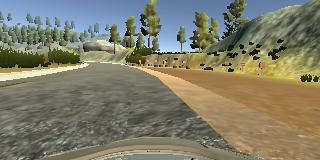

#Behavioral Cloning

This neural network was developed with the goal of steering a simulated car around a track with no input from the user. The project was completed as part of Udacity's Self-Driving Car Nano Degree. The network was heavily based on the architecture described in Nvidia's "End to End Learning for Self-Driving Cars" (http://images.nvidia.com/content/tegra/automotive/images/2016/solutions/pdf/end-to-end-dl-using-px.pdf). A few tweaks were made to the architecture in order to streamline the preprocessing of images fed into the network. The Nvidia model is a good basis for this project since it is relatively simple and has been proven to have good real world performance in completing a very similar task.

The network uses images captured from a virtual, front facing camera, centered on the car as input and the corresponding instantaneous steering angle as a label for the data. The base dataset was supplied by Udacity and additional input data was gathered using a training module within the simulator software. The additional data was created in order to give the network examples of the correct response in areas where the car was leaving the track during testing.

##Network Architecture

The network uses the following structure:

1.  Cropping layer
  * Removes pixel data from the top of each image. The area of the image removed contains only the sky and is not helpful for training the model to steer the car.
2.  Resize layer
  * The Nvidia architecture is designed for a 66x200 pixel input image - this layer scales the image to the expected size.
3.  Normalization layer
  * Image data is normalized to values between -0.5 and 0.5. This generally yields better results in training.
4.  Convolution layer (2x2 stride, 5x5 kernal, relu activation)
5.  Convolution layer (2x2 stride, 5x5 kernal, relu activation)
6.  Convolution layer (2x2 stride, 5x5 kernal, relu activation)
7.  Convolution layer (non-strided, 3x3 kernal, relu activation)
8.  Convolution layer (non-strided, 3x3 kernal, relu activation)
9.  100 neuron fully connected layer (relu activation)
10. 50 neuron fully connected layer (relu activation)
11. 10 neuron fully connected layer (relu activation)
12. 1 neuron output layer

Layers 4-12 reflect the architecture outlined in the Nvidia paper while layers 1-3 are unique to this network. Trials with the addition of dropout layers were made, but in all cases, the network performance dropped when these layers were present.

##Training

The initial training data was a filtered version of a sample dataset provided by Udacity. Since the main goal was to create a network that would do corrective steering when the car approached the edges of the road, all data where the car was receiving no input (i.e. instantaneous steering angle was 0) were filtered out. This means that the network was trained only on what to do when approaching the edges of the road. With this dataset, the network was able to steer the car through about 50% of the simulated track. The training was then fine-tuned by creating additional data for areas that the network was failing to navigate properly. The methodology for creating the fine tuning data was to position the car close to the edge that was causing issues, and then record the car being steered back to the center of the lane. The use of additional training data was minimized, and kept to only the first half of the course in order to prevent the network from simply memorizing the obstacles; it can be shown that the network is generalizing and responding to the additional training without over-fitting since it is able to navigate similar, but not identical, obstacles that were not directly trained for. By training the network with this additional data, the network was able to successfully navigate the car around the entire course.

*Figure 1: fine tuning image for difficult location where dirt road intersects the track. Large steering angle towards the center of the track was used to train the correct response to approaching dirt edges.*

Training was completed using the Adam Optimizer and an objective of minimal mean-squared-error. Since this is a regression, rather than a classification task, direct validation of the prediction accuracy is difficult. Therefore the network was tested by allowing it to control the simulated car and watching the results.
